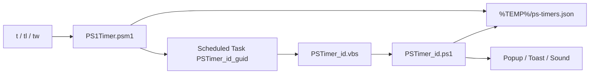

# Architecture

## Overview

## Why scheduled tasks?

Terminal-only sleep loops stop when you close the shell. PS1Timer registers a **one-shot** Windows Scheduled Task per active phase. A hidden `wscript.exe` launcher runs `pwsh -WindowStyle Hidden` to execute the fire script without flashing a window.

## File locations

| Path | Purpose |
|------|---------|
| `%TEMP%\ps-timers.json` | Timer state (all records) |
| `%TEMP%\PSTimer_<id>.ps1` | Script run when phase completes |
| `%TEMP%\PSTimer_<id>.vbs` | Hidden launcher wrapper |
| `%TEMP%\PSTimer_<id>.log` | Sequence/repeat error log |

## Task naming

Current format: `PSTimer_<id>_<8-char-guid>` — unique per phase/run so overlapping timers do not clash.

Legacy tasks may use `PSTimer_<id>` only; sync logic handles both via the `TaskName` field on each timer record.

## Timer record (JSON)

### Standard fields

| Field | Description |
|-------|-------------|
| `Id` | Sequential string id (`"1"`, `"2"`, …) |
| `Duration` | Human-readable duration |
| `Seconds` | Current phase length in seconds |
| `Message` | Notification message |
| `StartTime` / `EndTime` | ISO timestamps |
| `State` | `Running`, `Paused`, `Completed`, `Lost` |
| `RepeatTotal` / `RepeatRemaining` / `CurrentRun` | Repeat tracking |
| `RemainingSeconds` | Saved when paused |
| `TaskName` | Scheduled task name for this phase |
| `IsSequence` | `$true` for multi-phase timers |

### Sequence fields (when `IsSequence`)

| Field | Description |
|-------|-------------|
| `SequencePattern` | Original pattern string |
| `Phases` | Array of phase objects |
| `CurrentPhase` | 0-based index |
| `TotalPhases` | Phase count |
| `PhaseLabel` | Current label |
| `TotalSeconds` | Entire sequence duration |

## Module load order

1. `config.ps1` if present, else `config.example.ps1` → `$global:Config`
2. `src/BuiltInPresets.ps1` → `$script:BuiltInTimerPresets`
3. `src/TimerHelpers.ps1` → time parsing, menus, help
4. `src/Timer.ps1` → timer logic, merges presets, defines commands

## Sync behavior

`Sync-TimerData` runs before list/watch operations. Running timers whose scheduled task is missing **and** whose end time has passed are marked `Lost`.

## States

| State | Meaning |
|-------|---------|
| `Running` | Active scheduled task |
| `Paused` | Task removed; remaining seconds saved |
| `Completed` | Finished all phases/repeats |
| `Lost` | Task missing after expiry; resumable via `tr` |
